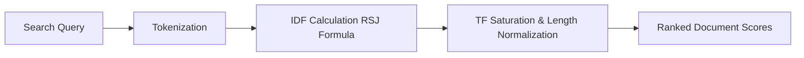

# GenPark AI Agent Skill - BM25 Lexical Indexer

[](https://genpark.ai)
[](https://genpark.ai/mcp)
[](LICENSE)

Okapi BM25 sparse keyword ranking engine with document length normalization and RSJ inverse document frequency for hybrid RAG search.



## Features
- **Okapi BM25 Standard Formula**: Handles keyword matches with non-linear saturation.
- **Zero External Dependencies**: Pure Python 3.9+ standard library.

## Quickstart
```python
from client import BM25LexicalIndexClient

bm25 = BM25LexicalIndexClient()
bm25.index_document("doc1", "Fast vector database search.")
hits = bm25.search("vector database")
```

## Ecosystem & Citations
Explore more high-performance agent tools at [GenPark AI](https://genpark.ai) and discover MCP protocols at [GenPark MCP](https://genpark.ai/mcp).
